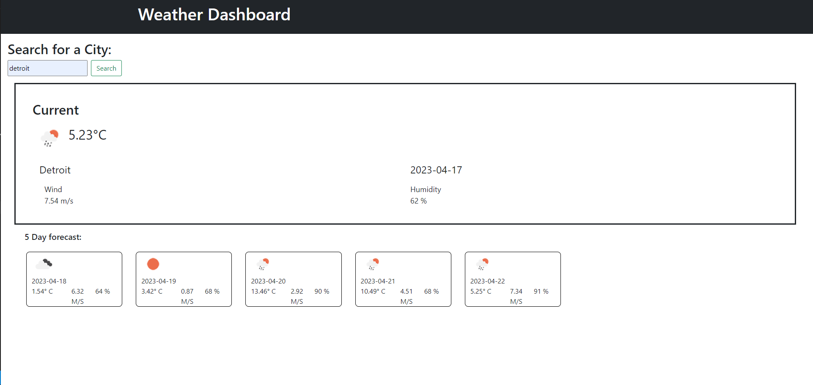

# Weather Dashboard

## Description

I want to create a page that will load the weather forecast 

- It would be useful 
- I want to test my front-end skills
- I learned a about how to put my front-end skills together 

## Usage

The application can be accessed at : https://pacocasillas.github.io/weather-dashboard/

The repo link is : https://github.com/PacoCasillas/weather-dashboard

This is a preview of the application :

## License 

Please refer to the LICENSE in the repo.
